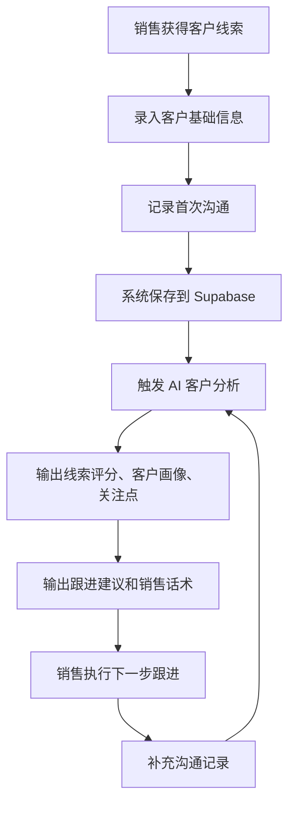

# 业务流程

```mermaid
flowchart TD
  A["销售获得客户线索"] --> B["录入客户基础信息"]
  B --> C["记录首次沟通"]
  C --> D["系统保存到 Supabase"]
  D --> E["触发 AI 客户分析"]
  E --> F["输出线索评分、客户画像、关注点"]
  F --> G["输出跟进建议和销售话术"]
  G --> H["销售执行下一步跟进"]
  H --> I["补充沟通记录"]
  I --> E
```

## 页面流程

1. 客户列表页查看所有线索。
2. 新增客户页录入客户基础信息。
3. 客户详情页查看基础信息、沟通记录和 AI 分析。
4. AI 分析面板生成客户画像和话术建议。
5. 跟进记录区沉淀每次沟通结果。
